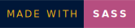
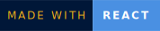
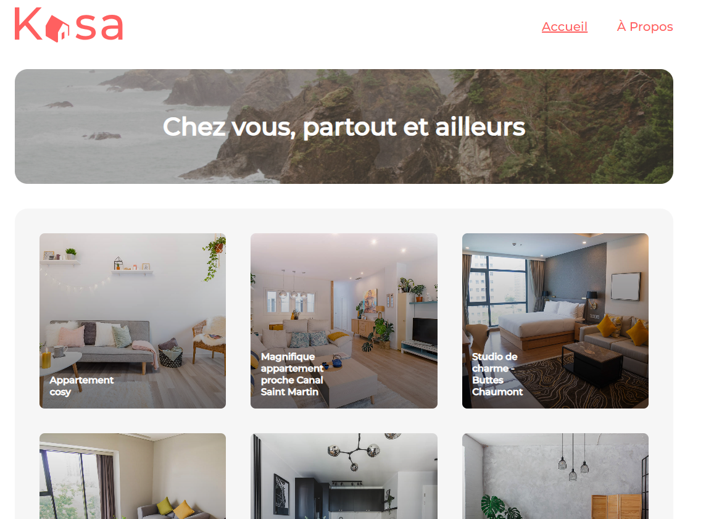

       

# Kasa 


Kasa is a peer-to-peer apartment rental website. 
This code is the frontend of the site developed in React.
 
## Screenshots


## Preview
- Figma Mockup link: `https://www.figma.com/file/qEno0LwL4ZLkWyeY59kxp1/UI-Design-Kasa-FR?node-id=0%3A1&mode=dev`
- GitHub Pages link: `https://merzakb.github.io/P8_Kasa_benaissi_merzak/` 

## Installation
To install and run this project locally on your machine, follow these simple steps:

1. Make sure you have Node.js installed on your machine. If not, you can download and install it from [the official Node.js website](https://nodejs.org/).

2. Clone this GitHub repository to your local machine using the following command:

    ```
    git clone https://github.com/Merzakb/P6-sophie-bluel
    ```

3. Run the following commands:

```bash
# Navigate to the application directory
cd cd P8_Kasa_benaissi_merzak
```

```bash
# Install dependencies
npm install
```

```bash
# Start local dev server
npm start
``` 

## Technologies :
      


## Authors
- [@Merzak](https://github.com/Merzakb)


## 🔗 Links
[](https://merzak-portfolio.vercel.app/)
[](https://www.linkedin.com/in/merzak-b-0300b9289/)
[](https://twitter.com/__merzak)


## Project Structure

Kasa/

- |-- public/
-  ||--index.html
- |-- src/
-  | |-- components/
-  | | |-- Banner/Banner.jsx
-  | | |-- Card/Card.jsx
-  | | |-- Collapse/Collapse.jsx
-  | | |-- Footer/Footer.jsx
-  | | |-- Header/Header.jsx
-  | | |-- Rating/rating.jsx
-  | | |-- Slide/Slide.jsx
- | |-- pages/
-  | | |-- About/About.jsx
-  | | |-- Home/Home.jsx
-  | | |-- NotFound/NotFound.jsx
-  | | |-- Room/Room.jsx
- | |-- data/
-  | | |-- roomList.js
- | |-- assets/
-  | |-- logo-header.svg
-  | |-- logo-footer.svg
- | |-- Sass/
-  | | |-- base/
-  | | |-- components/
-  | | |-- Layout/
-  | | |-- pages/
-  | | |-- utilities/
-  | | |-- index.scss
- | |-- App.jsx
- | |-- index.js
- |-- .gitignore
- |-- package.json
- |-- README.md


